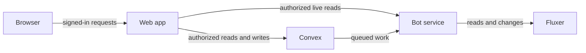

# How NeonFlux works

NeonFlux separates browser access, durable data, and Fluxer credentials so the bot token never reaches the browser or web server.

## Who owns what

- The **browser** receives a short-lived user token limited to one authorized server.
- The **web app** owns OAuth, sessions, authorization checks, and dashboard requests. It never receives the bot token.
- **Convex** stores durable state and coordinates queues, leases, approvals, and live dashboard updates.
- The **bot** owns the Fluxer credential, gateway connection, live provider reads, and all provider changes.
- **Fluxer adapters** translate validated NeonFlux data into provider requests and suppress unsafe mentions by default.

## Why queued work exists

Sending a message or changing a server can fail at awkward times. A request may reach Fluxer even when NeonFlux never receives the response.

NeonFlux records work before calling Fluxer, gives one worker a time-limited lease, checkpoints progress, and stores uncertain outcomes instead of blindly retrying them. This prevents many duplicate messages and repeated destructive server changes.

Messages and Server Blueprint use separate state machines because a single message send and a multi-step server deployment have different failure and recovery rules.

## Authentication

Convex accepts three separate identities:

| Identity       | Used for                                                       |
| -------------- | -------------------------------------------------------------- |
| Bot service    | bot workers and bot-owned durable writes                       |
| Web service    | server-side dashboard access and the private bot-read boundary |
| Signed-in user | browser live updates after server-side authorization           |

Each identity has its own issuer, audience, and signing key. Convex receives public verification keys, never private keys or Fluxer credentials.

For deployment configuration, read [Convex](Convex.md). For production containers, read [Docker](Docker.md).
