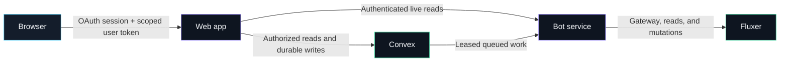

<h1 align="center">NeonFlux</h1>

<p align="center">
  <strong>A Fluxer bot with a protected, live web dashboard.</strong><br />
  Build messages, understand server activity, and safely review or apply complete server layouts.
</p>

<div align="center">

[](https://github.com/NeonTechSpace/NeonFlux/actions/workflows/ci.yml)

</div>

<div align="center">

[](https://github.com/NeonTechSpace/NeonFlux/tags)
    
[](https://github.com/NeonTechSpace/NeonFlux/tags)

</div>

> [!IMPORTANT]
> NeonFlux is an unreleased work in progress. This page describes implemented runtime surfaces, not a feature roadmap.

## NeonFlux at a glance

|                    | What it means                                                                         |
| ------------------ | ------------------------------------------------------------------------------------- |
| **Platform**       | One Fluxer bot and one authenticated management dashboard                             |
| **Useful today**   | Message delivery, server activity, command prefix, audit events, and Server Blueprint |
| **Durable state**  | Convex is the only application database and powers live dashboard updates             |
| **Deployment**     | One bot for one configured guild, or one bot serving multiple authorized guilds       |
| **Safety model**   | The bot alone owns Fluxer credentials and provider mutations                          |
| **Project status** | Active development. Database resets and breaking changes are expected                 |

## Two core workflows

### Send a message

Compose and preview a message, choose a text channel, send it through the durable queue, and follow its delivery state from the dashboard. Provider mutations run in the bot process. Ambiguous external outcomes are surfaced instead of being blindly retried.

### Shape a server with Blueprint

Capture or import a server layout, compare it with another server, review a deterministic plan, approve destructive changes, and follow the run through verification or reconciliation.

Blueprint currently includes:

- current-state export and inspection.
- named and scheduled backups with retention and drift checks.
- **Match blueprint**, **Merge without deletions**, and advanced **Reset and rebuild** policies.
- reviewed plans, fresh-state preflight, destructive confirmation, and automatic restore points.
- leased, checkpointed runs with pause, resume, cancel, verification, and recovery.

## What is implemented

<table>
  <thead>
    <tr>
      <th>Bot runtime</th>
      <th>Authenticated dashboard</th>
    </tr>
  </thead>
  <tbody>
    <tr>
      <td>
        <ul>
          <li>single- and multi-instance installation reconciliation.</li>
          <li>prefix, help, ping, and mention responses.</li>
          <li>message activity, member activity, and invite attribution.</li>
          <li>bounded best-effort growth telemetry.</li>
          <li>durable message-delivery and Blueprint workers.</li>
          <li>live provider reads through a private service boundary.</li>
        </ul>
      </td>
      <td>
        <ul>
          <li>Overview.</li>
          <li>Messaging → Message Builder.</li>
          <li>General Settings → Command Prefix.</li>
          <li>Events & Logs → Audit Events.</li>
          <li>Server Blueprint → Overview, Backups, Compare, Deploy, and Runs.</li>
        </ul>
      </td>
    </tr>
  </tbody>
</table>

Unlisted dashboard features are not implemented routes.

## How the pieces fit



The trust boundary is intentional:

- The **browser** receives only a short-lived, guild-scoped user token.
- The **web app** owns OAuth, sessions, authorization, and UI orchestration, but never the Fluxer bot token.
- **Convex** owns durable application state, transactions, queues, leases, and live updates.
- The **bot** owns Fluxer credentials, gateway state, provider reads, and provider mutations.

## Quick start

### 1. Prepare the workspace

Use Node **24.18.0** and pnpm **11**.

```sh
cd projects
pnpm install
cp .env.example .env
```

PowerShell users can replace the last command with `Copy-Item .env.example .env`.

`projects/.env` is the application configuration source of truth. The Convex CLI may create an ignored `.env.local` for deployment metadata. NeonFlux does not read application values from it.

### 2. Generate local secrets

```sh
pnpm setup:dev
```

The first command is a dry run: it lists the values that would be created without printing secret material. Apply the plan when it looks right:

```sh
pnpm setup:dev -- --write
```

The setup command preserves populated values and creates the session secret, token-encryption key, and three independent Convex signing/JWKS pairs. It reports, but cannot create, the Fluxer application ID, OAuth client secret, and bot token that still need to be supplied in `.env`.

### 3. Validate Convex configuration

These commands validate local public configuration and preview the selected remote target. They do not mutate it:

```sh
pnpm convex:validate-auth-config
pnpm convex:configure-auth-env -- --deployment <target>
pnpm convex:configure-runtime-env -- --deployment <target>
```

Applying configuration requires both `--apply` and exact target confirmation:

```sh
pnpm convex:configure-auth-env -- --deployment <target> --apply --confirm-apply-target <target>
pnpm convex:configure-runtime-env -- --deployment <target> --apply --confirm-apply-target <target>
pnpm convex:check-auth-env -- --deployment <target> --compare-deploy-env
```

See the [Convex guide](docs/Convex.md) for the complete authentication, target, retention, and self-hosting workflow.

### 4. Run NeonFlux

```sh
pnpm dev
```

This uploads and checks Convex functions once, then starts the Convex, bot, and web development processes together.

For isolated work:

```sh
pnpm dev:bot
pnpm dev:web
```

The homepage and public docs can render with only the web process. The authenticated dashboard needs configured Convex authentication and the bot: the bot bootstraps deployment state and owns live Fluxer access.

## Workspace map

All application code lives under `projects`.

| Path                 | Responsibility                                                   |
| -------------------- | ---------------------------------------------------------------- |
| `apps/bot`           | Fluxer gateway, private live-read service, and bot-owned workers |
| `apps/web`           | OAuth, sessions, public pages/docs, and protected dashboard      |
| `convex`             | Durable schema, transactions, queues, and live-query functions   |
| `packages/config`    | Typed environment parsing and runtime boundaries                 |
| `packages/convex`    | Scoped Convex JWT and client helpers                             |
| `packages/core`      | Cross-feature deployment and authorization policy                |
| `packages/messaging` | Canonical outgoing-message contracts and delivery policy         |
| `packages/blueprint` | Canonical Blueprint snapshots, plans, diffs, and protocol        |
| `packages/db`        | Typed Convex transport and persistence contract                  |
| `packages/fluxer`    | Fluxer clients, DTO projection, and provider adapters            |

Apps orchestrate the focused Messaging and Blueprint contracts rather than redefining them.

<details>
<summary><strong>Convex identity model</strong></summary>

Convex authenticates three isolated JWT providers:

| Provider    | Used by                                                | Default audience       |
| ----------- | ------------------------------------------------------ | ---------------------- |
| Bot service | Bot-to-Convex calls                                    | `neonflux-convex-bot`  |
| Web service | Web-to-Convex calls and the internal bot-read boundary | `neonflux-convex-web`  |
| User        | Browser live subscriptions after server authorization  | `neonflux-convex-user` |

Each provider needs a distinct issuer and RSA key pair. Convex receives only the issuer, audience, and public JWKS tuple. It must never receive a private JWT key, Fluxer bot token, OAuth secret, session secret, or token-encryption key.

</details>

<details>
<summary><strong>Data lifecycle and delivery guarantees</strong></summary>

`NEONFLUX_DATA_RETENTION_DAYS` controls historical growth, audit, and completed Blueprint workflow retention. It defaults to 90 days and accepts integers from 1 through 730. Daily Convex jobs drain expired records in bounded batches while protecting active, paused, reconciliation-required, and outcome-unknown runs.

Message activity persists `(guildId, messageId)` receipts before incrementing aggregates. Member joins deduplicate by membership identity. Fluxer member-leave callbacks have no reliable event identity, so leave tracking is explicitly at-least-once and may overcount provider redelivery.

Growth ingestion is best effort: four writes may run concurrently and at most 1,000 more are queued. Overload, shutdown, or persistence failure is logged without blocking the primary bot event path.

</details>

<details>
<summary><strong>Reset a development Convex deployment</strong></summary>

The reset wrapper replaces every table in the selected deployment with an empty schema-shaped snapshot. It is destructive and refuses ambient non-dry-run targets.

```sh
pnpm convex:dev:once
pnpm convex:reset-data -- --deployment dev --dry-run
pnpm convex:reset-data -- --deployment dev --yes
```

Production additionally requires explicit acknowledgement:

```sh
pnpm convex:reset-data -- --prod --confirm-production-reset --dry-run
pnpm convex:reset-data -- --prod --confirm-production-reset --yes
```

The wrapper rejects `--deployment local`. Operate a manually created local deployment with the Convex CLI directly.

</details>

## Validation

Run the complete workspace quality gate from `projects`:

```sh
pnpm check
```

After changing web routes, regenerate the TanStack route tree and build the production app:

```sh
pnpm --filter neonflux-web generate-routes
pnpm --filter neonflux-web build
```

The web build also enforces dashboard bundle boundaries: shells cannot absorb sibling features or optional heavy tools, and accepted production chunk limits cannot regress silently.

## Deploy with Docker

Use the [Docker guide](docs/Docker.md) with [`projects/.env.example`](projects/.env.example).

- Application stack: [`projects/docker-compose.yml`](projects/docker-compose.yml)
- Optional self-hosted Convex stack: [`projects/docker-compose.convex.yml`](projects/docker-compose.convex.yml)

## Repository activity


## License

NeonFlux is available under the [Apache License 2.0](LICENSE).
